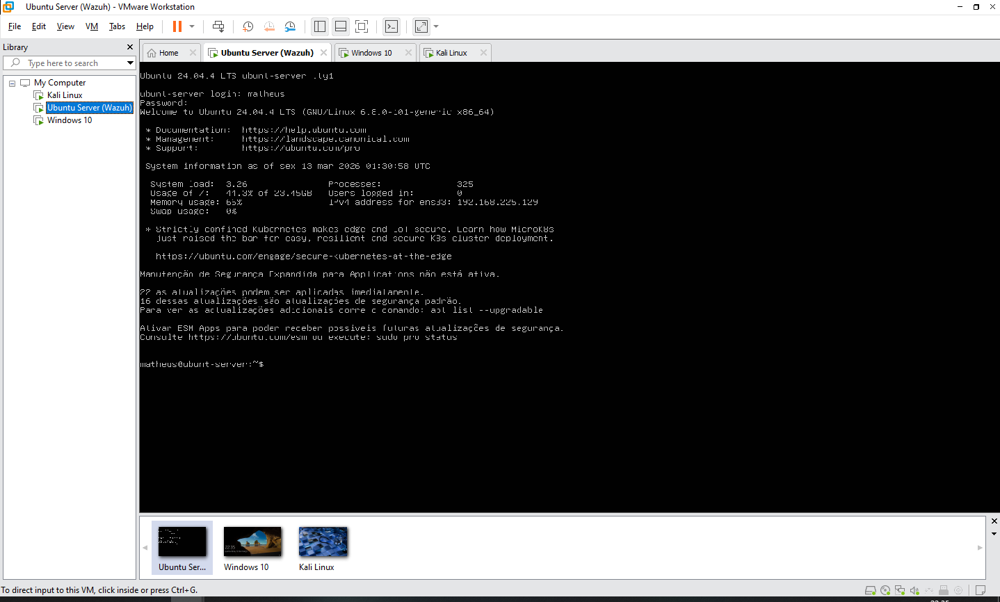
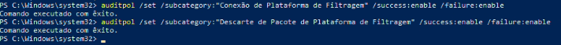
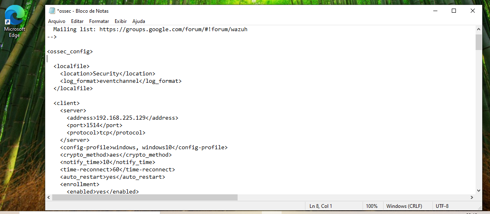
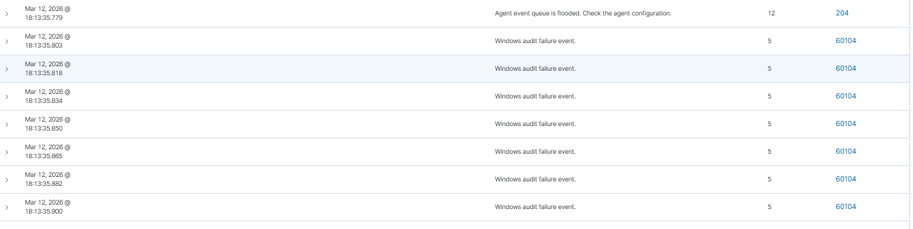
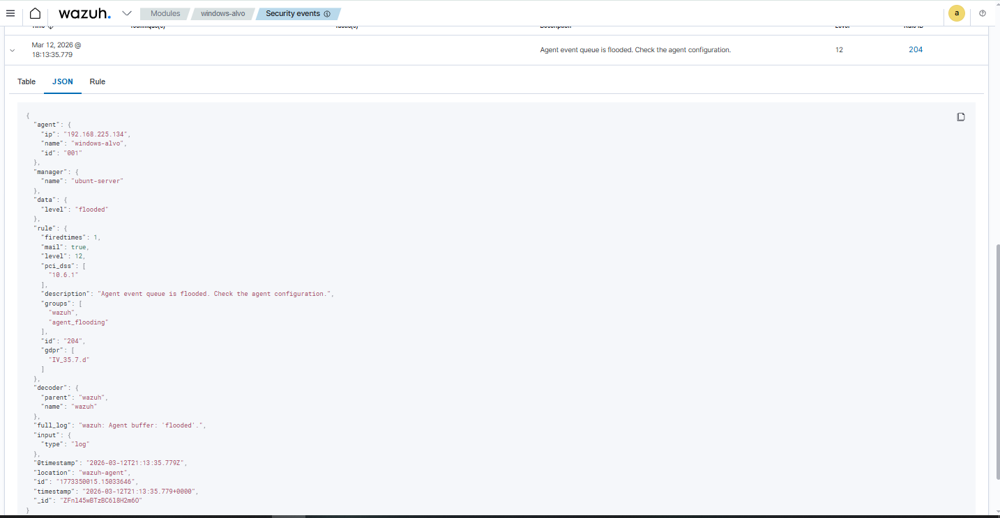

🛡️ **1. O Projeto: Meu Laboratório de Monitoramento e Detecção**

Este projeto documenta a implementação de um ambiente de **Security Operations Center (SOC)** real, utilizando o **Wazuh (SIEM/XDR)** como cérebro central para detecção de ameaças em um endpoint Windows. O objetivo é demonstrar competência técnica em **Arquitetura de Segurança**, **Auditoria de Sistemas Operacionais** e **Engenharia de Detecção**.

⚙️ **2. Arquitetura do Laboratório**

Para este laboratório, utilizei o **VMware Workstation Pro** para garantir o isolamento da rede e o controle total dos ativos.

|**Máquina Virtual**|**Sistema Operacional**|**Função no SOC**|**Configuração Lógica**|
|---|---|---|---|
|**Wazuh Server**|Ubuntu Server 24.04|**O Cérebro (SIEM)**|Wazuh Manager All-in-One (Indexer/Dashboard)|
|**Windows Alvo**|Windows 10/11|**A Vítima (Endpoint)**|Monitorado via Wazuh Agent|
|**Kali Atacante**|Kali Linux 2024.x|**O Invasor**|Origem dos ataques (Nmap/Brute Force)|

🔍 **3. O Desafio: O "Ponto Cego" de Rede**

Durante os testes iniciais, identifiquei que o Windows nativo é "silencioso". Ao realizar um scan de portas com o **Nmap** do Kali, o Windows bloqueava as conexões, mas não gerava logs. O meu SIEM permanecia cego, sem nenhum alerta.

**Minha Solução: Auditoria Nativa (Auditpol)**
Para resolver esse ponto cego, forcei o Windows a registrar cada interação de rede. Utilizei o comando auditpol para ativar a auditoria da Camada de Filtragem do Windows.

# Comandos que utilizei no PowerShell (Admin):

`auditpol /set /subcategory:"Conexão de Plataforma de Filtragem" /success:enable /failure:enable`

`auditpol /set /subcategory:"Descarte de Pacote de Plataforma de Filtragem" /success:enable /failure:enable`

🛠️ **4. Engenharia de Detecção: Ajustando o Wazuh**

Identifiquei que o arquivo de configuração padrão do agente Wazuh (ossec.conf) possuía filtros de exclusão que ignoravam o **Event ID 5156** (Conexão de Rede). Realizei a edição manual do arquivo para habilitar a visibilidade total.

⚔️ **5. Simulação de Ataque e Análise de Incidentes**

Com a telemetria ativada, realizei um ataque de reconhecimento agressivo com o **Nmap** (sudo nmap -sS -p 1-5000 -T5).

**O Flagrante (Análise de Log)**

O SOC detectou instantaneamente o ataque. Analisei o **JSON bruto** do evento e identifiquei os seguintes pontos críticos:

- **Event ID 5152:** Confirmação de que o Firewall do Windows barrou a conexão.
    
- **IP de Origem (192.168.225.128):** Identificação exata do atacante (Kali).
    
- **Nível de Severidade 12 (Critical):** Devido à agressividade do ataque, o sistema detectou um **Agent Flooding**, alertando que o volume de logs ultrapassou o buffer do agente.

📈 **6. Próximos Passos: Monitoramento Avançado com Sysmon**

O Auditpol me deu a visibilidade de **Rede**. O próximo passo do meu portfólio será a implementação do **Sysmon** para obter visibilidade de **Processos**, permitindo identificar exatamente qual programa está sendo alvo de ataques ou agindo de forma anômala no sistema.

**Analista de SOC:** Matheus Dantas **Foco:** Defesa, Monitoramento e Resposta a Incidentes.